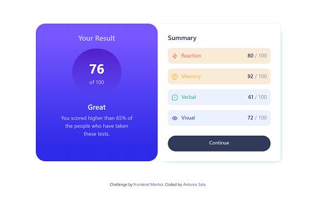

# Frontend Mentor - Results summary component

- The challenge
- Screenshot
- Built with
- Author

## The challenge

Users should be able to:

- View the optimal layout for the interface depending on their device's screen size
- See hover and focus states for all interactive elements on the page

### Screenshot

#### Built with

- Semantic HTML5 markup
- CSS custom properties
- Flexbox
- Bootstrap 4
- Mobile-first workflow

##### Author

- Website - "https://antoniosala.online"
- Frontend Mentor - "https://www.frontendmentor.io/profile/Antho137"
- Twitter - "https://www.twitter.com/antoniosala73"